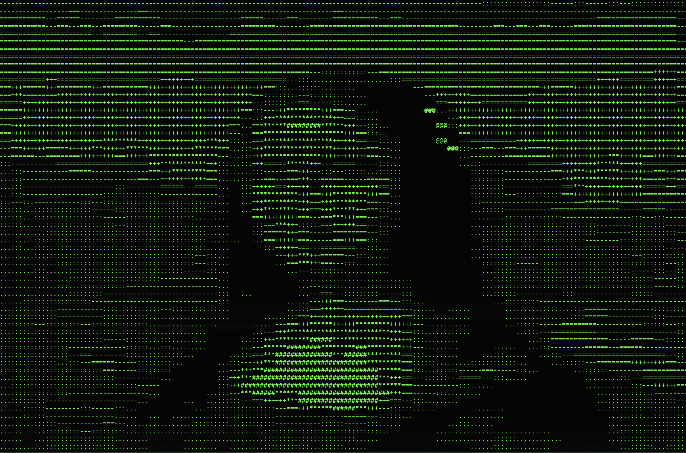

# image2ASCII
Convert images to ASCII art, like this one!



## Project Overview
Image2ASCII is a command line application that converts images to ASCII art.

Converting images to ASCII is surprisingly simple, it can be done in 3 steps:
1. Computing the pixel matrix (a fancy way of saying go through each pixel in the image)
2. Convert the RGB values(the color of the pixel) using some formula to ASCII characters
3. Print the ASCII characters

That's it!

## Run image2ASCII
Clone the repo, download the image of choice, and run the following command:

```shell
python main.py -f image_filepath
```


## Project Files

### `main.py`

#### `def calculate_pixel_luminosity(red: int, green: int, blue: int) -> int:`
Calculates and returns the pixel luminosity by forming a weighted average to account for
human perception, using this formula:

    L = 0.2126 R + 0.7152 G + 0.0722 B

Since humans are more sensitive to green light, it is weighted the most heavily, followed
by red, then blue.

#### `def compute_ascii_character_map(pixel_luminosity: int, maximum_luminosity: int) -> str:`
Computes ASCII character based on the luminosity percentage, multiplied the length of the
ASCII matrix, subtracted by 1 (to account for the index) to get the index of the character
to map to.

`map_index = ( (pixel_luminosity / maximum_luminosity) * length of ASCII matrix ) - 1`

#### `def compute_pixel_matrix(image) -> list[list[str]]:`
Takes a PIL.Image object, goes through each of the pixels, maps the pixel's RGB values to
an ASCII character, storing in a 2D array.

#### `def main() -> None:`
Prints out the image in ASCII